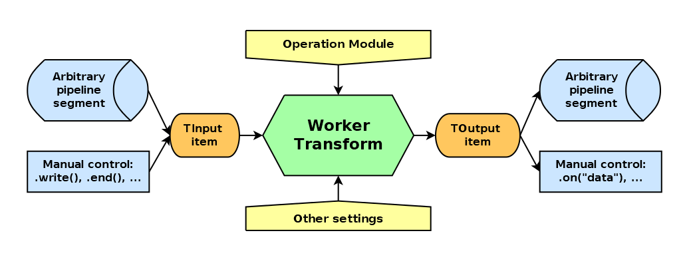

# worker-transform

_Multithread mapping stream_


[](https://badge.fury.io/js/@giancosta86%2Fworker-transform)
[](/LICENSE)



**worker-transform** provides a `WorkerTransform` object-oriented stream that _transparently_ runs a given operation _on multiple items, concurrently_, by internally managing a pool of _worker threads_.

Like any other standard `Transform`, this stream can be _plugged into a pipeline_, as well as _manually controlled_; for maximum performance, _the item order is not guaranteed_.

## Installation

```bash
npm install @giancosta86/worker-transform
```

or

```bash
yarn add @giancosta86/worker-transform
```

The public API entirely resides in the root package index, so you shouldn't reference specific modules.

## Usage

1. First of all, you need an **operation module**: a module exporting just the **operation** - _a function_ that will be _applied to every item flowing through the stream_.

   The operation must be:

   - with an _arbitrary name_

   - accepting _one parameter_ - of type `ChunkInput<TInput>` - where you need to replace `TInput` with the actual type of the items _entering_ the stream

     `ChunkInput<TInput>` actually contains just two fields, provided by the underlying stream infrastructure:

     - `value` - the item entering the stream

     - `encoding` - the associated _character encoding_. Actually meaningful only when the item is a string

   - returning one of these two types:

     - `ChunkOutput<TOutput>` - if the function is _synchronous_ (without interruptions). You need to replace `TOutput` with the type of the items _produced_ by the stream.

       The `ChunkOutput<TOutput>` type contains the `value` to be produced by the function as well as the related `encoding` - but the latter is optional, because it is meaningful only if the output items are strings

       > The result of the function _must_ be a `ChunkOutput<T>` - but such `T` **can** be a _nullable_ type, such as `number | null`!
       > When the `value` field of the returned `ChunkOutput` is `null`, the stream will just skip it!

     - `Promise<ChunkOutput<TOutput>>` - if the function is _asynchronous_ - i.e., if it could perform `await` on external conditions or, more generally, if it is designed to return a `Promise`. Again, you need to replace `TOutput` with the type of the items produced by the stream - which, again, can be _nullable_

   - _throwing errors_ when needed: both errors and rejected promises simply make the stream _ignore_ the related input element

   An operation module with a **synchronous** operation could be:

   ```typescript
   import { ChunkInput, ChunkOutput } from "@giancosta86/worker-transform";

   function add200({ value }: ChunkInput<number>): ChunkOutput<number> {
     return { value: value + 200 };
   }

   export = add200;
   ```

   On the other hand, an operation module with an **asynchronous** operation could be:

   ```typescript
   import delay from "delay";
   import { ChunkInput, ChunkOutput } from "@giancosta86/worker-transform";

   async function add500({
     value
   }: ChunkInput<number>): Promise<ChunkOutput<number>> {
     await delay(5);
     await delay(2);
     await delay(6);

     return { value: value + 500 };
   }

   export = add500;
   ```

1. Create an instance of `WorkerTransform` - passing at least **the path to the operation module** as expected by `resolve()`, and maybe additional options (see the description below)

   For example:

   ```typescript
   import { join } from "node:path";
   import { WorkerTransform } from "@giancosta86/worker-transform";

   const modulePath = join(__dirname, "add200");

   const transform = new WorkerTransform(modulePath);
   ```

1. Use it like any other standard stream - for example, in a _pipeline_:

   ```typescript
   await pipeline(Readable.from([90, 95, 98]), transform, someWritableStream);
   ```

### Additional constructor options

The following values can be passed to the constructor as fields of an optional object, right after the operation module path:

- **agentCount**: the number of worker threads in the pool. **Default**: the number of processors

- **logger**: a `Logger` interface, as exported by [unified-logging](https://github.com/giancosta86/unified-logging). **Default**: no logger

- **highWaterMark**: if present, passed to the base constructor

- **signal**: if present, passed to the base constructor

## Further reference

For additional examples, please consult the test suites in the source code repository.
